# S-Project 3: ICU/SICU Star Schema Design & Critical Care Bed Analysis (SQL + Data Warehousing)

This project designs a **Star Schema** for ACME Health’s ICU/SICU hospital network and performs analytical summarization of **licensed, census, and staffed beds** across all facilities.  
The analysis supports leadership’s goal of identifying hospitals best suited for a **nurse staffing intervention pilot**.

* **Tools:** SQL, MySQL Workbench, Data Warehousing concepts  
* **Techniques:** Dimensional modeling, star schema design, fact/dimension identification, hospital performance analytics  
* **Goal:** Model critical care resources and identify top-performing hospitals with ICU/SICU capacity.

---

# 🧱 1. Dimensional Modeling (Fact & Dimension Identification)

The dataset includes three core tables: **bed_type**, **business**, and **bed_fact**.

### 📌 Dimension Table — `bed_type`

  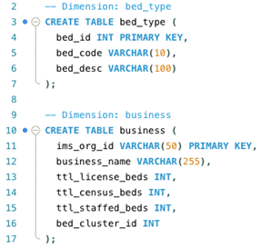

This table describes the type of bed (ICU, SICU, etc.).

| Column    | Example Type | Role        | Description                |
|-----------|--------------|------------|----------------------------|
| bed_id    | INT (PK)     | Key         | Unique identifier for bed type |
| bed_code  | VARCHAR      | Dimension   | Short code for bed type (e.g., 4 = ICU, 15 = SICU) |
| bed_desc  | VARCHAR      | Dimension   | Full description of bed type |

---

### 📌 Dimension Table — `business`

This table represents each hospital / business unit and includes some aggregate metrics.

| Column           | Example Type | Role              | Description                                      |
|------------------|--------------|-------------------|--------------------------------------------------|
| ims_org_id       | INT (PK)     | Key               | Unique hospital / organization ID                |
| business_name    | VARCHAR      | Dimension         | Name of the hospital                             |
| bed_cluster_id   | INT          | Dimension         | Grouping/cluster ID for bed management           |
| ttl_license_beds | INT          | Pre-aggregated fact | Total licensed beds at this hospital            |
| ttl_census_beds  | INT          | Pre-aggregated fact | Total census beds at this hospital              |
| ttl_staffed_beds | INT          | Pre-aggregated fact | Total staffed beds at this hospital             |

---

### 📌 Fact Table — `bed_fact`

  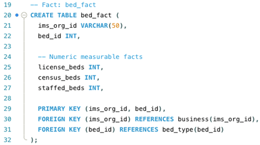

This is the **central fact table** that stores ICU/SICU bed metrics at the hospital–bed type level.

| Column       | Example Type | Role    | Description                                      |
|--------------|--------------|---------|--------------------------------------------------|
| ims_org_id   | INT (FK)     | Key     | References `business.ims_org_id`                 |
| bed_id       | INT (FK)     | Key     | References `bed_type.bed_id`                     |
| license_beds | INT          | Fact    | Number of licensed beds for this bed type        |
| census_beds  | INT          | Fact    | Number of census beds for this bed type          |
| staffed_beds | INT          | Fact    | Number of staffed beds for this bed type         |

Together, these three tables form the basis of a **star schema**, with `bed_fact` at the center and `business` / `bed_type` as dimension tables.

---

# ⭐ 2. Star Schema (MySQL Workbench)

The final schema contains:

### ⭐ **FACT TABLE**
- **bed_fact**  
  - license_beds  
  - census_beds  
  - staffed_beds  

### ⭐ **DIMENSION TABLES**
- **bed_type**  
- **business**

All dimensions join to the fact table via PK → FK relationships.

  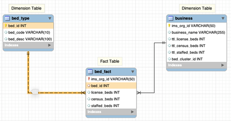

  
  
<em>Star Schema for ICU/SICU resource modeling.</em>

---

# 📊 3. ICU & SICU Capacity Analysis (Leadership View)

Leadership requested:

> “Identify top hospitals with ICU (bed_id = 4) or SICU (bed_id = 15), ranked by total licensed beds.”

### ✔ Licensed Beds — Top Hospitals  

  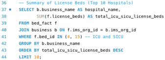

  
  
<em>Top 10 hospitals by ICU/SICU licensed beds.</em>

**Top hospitals (licensed beds):**
- Phoenix Children’s Hospital — 247  
- University of Maryland Medical Center — 220  

---

### ✔ Census Beds — Top Hospitals  

  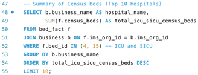

  
  
<em>Top 10 hospitals by ICU/SICU census beds.</em>

**Top hospitals (census beds):**
- Shands Hospital (University of Florida) — 167  
- Dallas County Hospital Association — 145  

---

### ✔ Staffed Beds — Top Hospitals  

  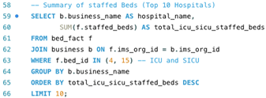

  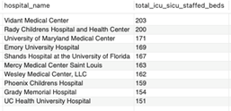
  
<em>Top 10 hospitals by ICU/SICU staffed beds.</em>

**Top hospitals (staffed beds):**
- Vidant Medical Center — 203  
- Rady Children’s Hospital — 200  

---

# 🔍 4. Drill-Down: Hospitals With BOTH ICU & SICU

Leadership asked for deeper review of facilities containing **both** ICU and SICU bed types.

### ✔ Licensed Beds (ICU + SICU)

  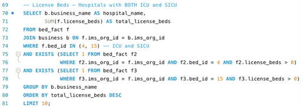

  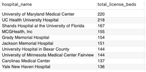

### ✔ Census Beds (ICU + SICU)

  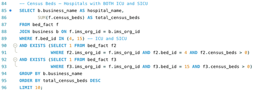

  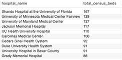

### ✔ Staffed Beds (ICU + SICU)

  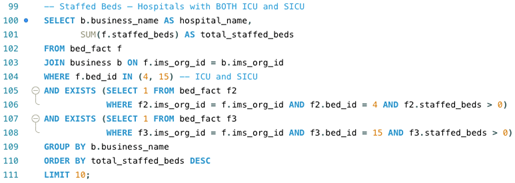

  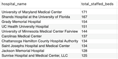

---

# 🧠 5. Recommendation to ACME Leadership

Based on consistent top rankings across **licensed, census, and staffed beds**, the two best candidates for the nurse staffing intervention are:

### 🟦 **1. University of Maryland Medical Center**  
- #1 licensed  
- #2 census  
- #1 staffed  
➡ Strongest overall ICU/SICU capacity.

### 🟩 **2. Shands Hospital at the University of Florida**  
- #3 licensed  
- #1 census  
- #2 staffed  
➡ High demand + strong capacity = ideal pilot site.

These hospitals show:

- High patient volumes  
- Large ICU/SICU capacity  
- Consistent performance across multiple metrics  
- Readiness for nurse staffing improvements  

---

# 🧠 Skills Demonstrated
- Dimensional modeling (facts vs. dimensions)  
- Star schema design  
- MySQL Workbench ERD construction  
- Critical-care analytics using bed metrics  
- Executive-level summarization and recommendation  
- Healthcare data interpretation  

